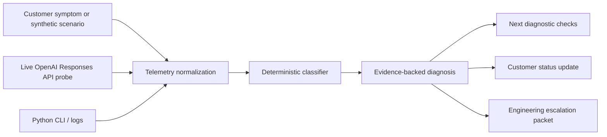

# Tracepoint architecture

Tracepoint models a support-engineering incident workflow rather than a general-purpose AI chat application.

## 1. Incident sources

Tracepoint accepts two kinds of evidence:

- **Synthetic scenarios** let the UI demonstrate known failure classes without creating real failures or requiring an API key.
- **Live probes** call the OpenAI Responses API from a server-side Next.js route and record the resulting request metadata.

Both paths are converted to the same `Telemetry` shape. That is deliberate: the diagnosis layer should not care whether the event came from a demo, a production probe, or eventually an imported log file.

## 2. Telemetry layer

The normalized incident record includes:

- HTTP status, when a response was received
- timestamp
- model
- measured request latency
- OpenAI `x-request-id`, when returned
- caller-generated `X-Client-Request-Id`
- attempt count
- error or success message

This preserves the context needed to compare samples and prepare an escalation.

## 3. Deterministic diagnosis

`lib/diagnostics.ts` classifies known failure families before any generative AI is involved:

- 400: request validation / integration
- 401: authentication
- 403: authorization / permissions
- 429: rate limit / capacity
- no completed response: timeout / network path
- 5xx: upstream / server error
- successful response: healthy baseline

The rules return severity, likely cause, evidence, next checks, a customer-facing update, and whether engineering escalation is warranted.

This design is intentional. An incident console should preserve facts and deterministic signals first. A future AI-assisted investigator can propose hypotheses, summarize evidence, and suggest next steps, but it should not replace raw telemetry or invent a root cause.

## 4. Live API probe

`app/api/probe/route.ts` keeps `OPENAI_API_KEY` on the server. The browser calls the local `/api/probe` route, which then calls `POST /v1/responses`.

The route:

1. generates a client request ID
2. starts a latency timer
3. sends a minimal Responses API request
4. captures HTTP status and `x-request-id`
5. normalizes the response into `Telemetry`
6. passes the telemetry through the diagnostic engine
7. returns telemetry, diagnosis, and escalation packet to the UI

The API key is never sent to the browser.

## 5. Escalation packet

A weak escalation says: "the customer is getting errors."

Tracepoint instead structures:

- observed status and error
- request/client-request IDs
- model
- timestamp
- latency
- support-side diagnosis
- checks already completed
- next checks
- a precise engineering ask

The goal is to reduce back-and-forth between Support and Engineering.

## 6. Python tooling

The Python scripts show that the same support workflow can exist outside the web UI:

- `live_probe.py` performs a minimal API health probe and emits JSON telemetry.
- `incident_triage.py` accepts JSON telemetry and returns a diagnosis and escalation packet.

That makes the project useful as both a portfolio UI and an example of support automation/scripting.

## Planned extensions

- retry/backoff instrumentation with jitter
- streaming and time-to-first-token measurements
- latency distributions such as P50/P95/P99
- incident history and timelines
- JSON/CSV log ingestion
- secret and PII redaction
- AI-assisted hypothesis generation after deterministic triage
